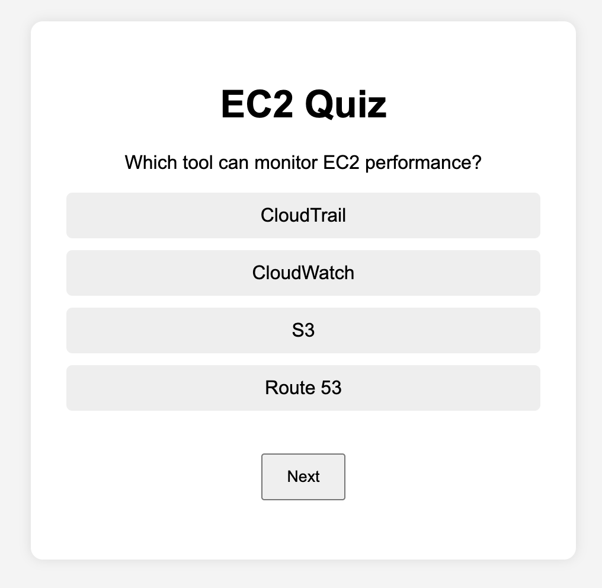
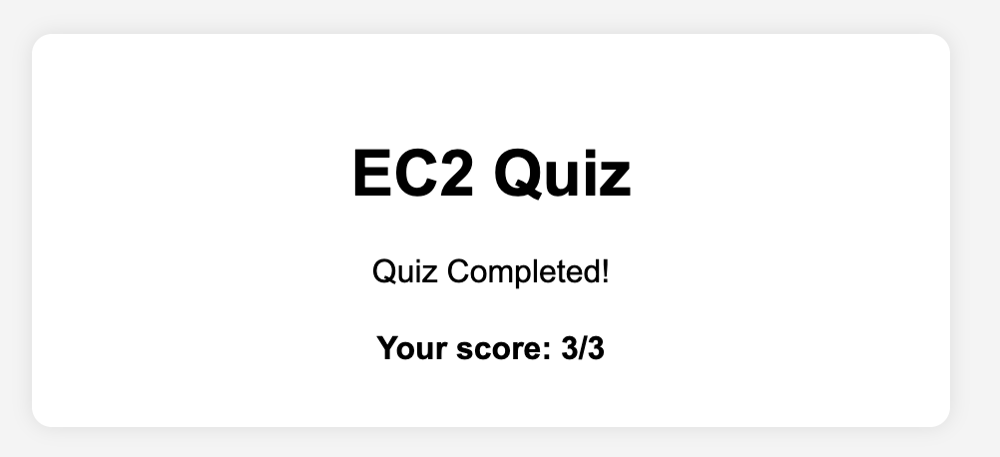

# 🚀 AWS EC2 Full Project

This is a complete hands-on project to help you **master AWS EC2** from scratch, covering everything from launching basic instances to deploying a full, scalable, monitored cloud application.

By doing this project, you'll gain **practical knowledge** of EC2 and related services like EBS, AMIs, Load Balancing, Auto Scaling, and CloudWatch.

---

## 📸 Screenshots

Here are snapshots of the **Week 1 EC2-hosted Quiz Web App**:

---

## 📚 Project Documentation

These documents guide you through each week's EC2 hands-on mini projects:

- [Mini Project 01 – Week 1: EC2 Basics & Web Server Quiz](docs/mini-project-01.docx)
- [Mini Project 02 – Week 2: EBS, Snapshots & Security](docs/mini-project-02.docx)

---

## ✅ Week-by-Week Progress

### ✅ Week 1 – Web App on EC2

- Launched an Amazon Linux 2 EC2 instance
- Installed Apache HTTP Server
- Created and deployed a simple EC2 quiz web app using HTML, CSS, and JS
- **Concepts Covered:**
  - What is EC2? (History, meaning, real-world examples)
  - Use cases: websites, applications, APIs, batch processing, etc.
  - EC2 instance types and pricing models
  - How to connect using SSH
  - Hands-on with Amazon Linux 2 and Ubuntu instances

### ✅ Week 2 – EBS, AMIs, and Security

- Created, attached, and managed **EBS volumes**
- Created and restored **EC2 Snapshots**
- Created **Custom AMIs** for backups and reuse
- Learned about:
  - Key pairs and secure authentication
  - Security Groups vs NACLs
  - IAM roles and policies (intro only)
- Hands-on integration with Week 1 web app for secure access and backup

### ⏳ Week 3 – Load Balancing and Auto Scaling (In Progress)

- Deploy multiple EC2 instances behind an Application Load Balancer
- Create Auto Scaling Groups with Launch Templates
- Set scaling based on CloudWatch CPU metrics

### ⏳ Week 4 – Monitoring, Automation, and Full Deployment (In Progress)

- Configure **CloudWatch dashboards and alarms**
- Automate using **User Data scripts**
- Understand EC2 Image Builder
- Compare Spot, On-Demand, and Reserved instances
- Final project: Deploy a **multi-instance**, **secured**, **auto-scaled**, **monitored** EC2 setup

---

## 📘 EC2 Overview

**Amazon EC2 (Elastic Compute Cloud)** is a foundational AWS service that provides virtual servers (instances) in the cloud. It allows you to rent and manage computing resources on demand, just like you would manage physical machines—but faster, more scalable, and cost-efficient.

### 💡 Quick Breakdown:
- **E**lastic → You can scale up or down as needed.
- **C**ompute → Provides CPU, RAM, networking, and storage.
- **C**loud → Fully virtual, accessible over the internet.

### ✅ Real-World Examples:
- Hosting websites and APIs
- Running game servers
- Big data analytics
- CI/CD and DevOps environments
- Machine learning training pipelines

---

## 🎯 What You'll Learn By Completing This Project

- Core EC2 concepts, features, and pricing models
- Secure instance access and IAM policies
- Launch and manage EBS volumes, snapshots, and AMIs
- Build fault-tolerant architectures with Load Balancers and Auto Scaling
- Monitor your EC2 resources using CloudWatch
- Deploy a full-stack, production-ready EC2 setup

---

Stay tuned — Week 3 and Week 4 updates are coming soon!

If you liked this project, feel free to ⭐ star the repo and share!

